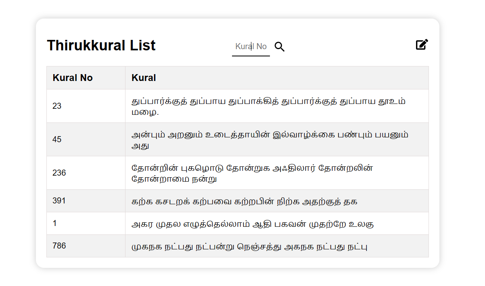
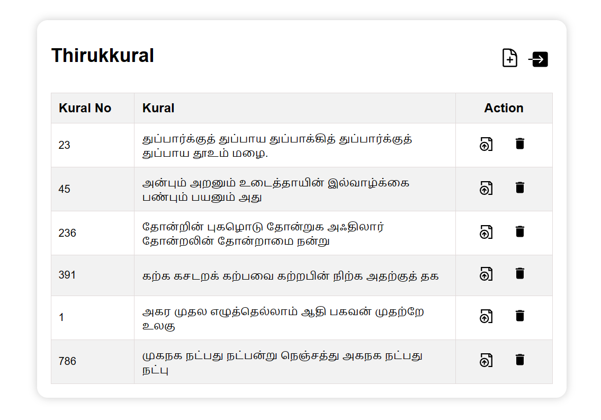

# Thirukkural Crud 

### Main EndPoint
> `https://thirukkural-crud.netlify.app/`

### Visiting:

#### Landing Page

`/` - will get you to the list of Thirukkural data stored in database (if any) with its kural number. To get a random kural, just enter the kural number in the search bar.

`/home` - If you like to add - `/create` or update - `/update/:id` or delete a kural you can use this endpoint.

